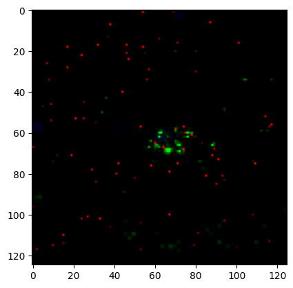

# Graph Neural Networks for Particle Momentum Estimation in the CMS Trigger System


## Dataset structure

The dataset consists of several parquet files that contain 4 columns - 3 feature columns and 1 Label column

The schema of the dataset is:

```
<pyarrow._parquet.ParquetSchema object at 0x7fb95f035b00>
required group field_id=-1 schema {
  optional group field_id=-1 X_jets (List) {
    repeated group field_id=-1 list {
      optional group field_id=-1 item (List) {
        repeated group field_id=-1 list {
          optional group field_id=-1 item (List) {
            repeated group field_id=-1 list {
              optional double field_id=-1 item;
            }
          }
        }
      }
    }
  }
  optional double field_id=-1 pt;
  optional double field_id=-1 m0;
  optional double field_id=-1 y;
}
```

The column `X_jets` contains nested array which can be rearranged to `125x125` matrices in 3-channel images for 2 classes of particles, quarks and gluons, impinging on a calorimeter.

See [this notebook](X_jet_vis.ipynb) to see more samples from `X_jets`

When rearranged, a sample from `X_jets` would look like:




## Conversion of image dataset to graph dataset


### **Node Processing**

* After converting a sample from `X_jets` to an image, we select all the non-zero pixels as nodes.
* The corresponding values of `pt` and `m0` were also concatenated with each node of the graph.

### **Edge Processing**

* Neighbors are defined as points within the top k nearest distances, where k values of 10, 15, and 25 were experimented. The Minkowski metric was used to calculate distances between points.
 
* Using sklearn's `kneighbors_graph` function, a connectivity matrix composed of ones and zeros was generated to represent edge connections between points. 
* To conserve memory and conform to PyG's graph data format, the matrix was converted to COO format.


See [this notebook](Data_Process.ipynb) the conversion of image dataset to graph dataset


## Results

2 different architectures were experimented with:

| Model        | Test Loss | Test Accuracy | Test AUROC |
|--------------|-----------|---------------|------------|
| SAGE Conv    | 0.5703    | 72.3333%      | 0.7239     |
| Graph Conv   | 0.5925    | 71.85%        | 0.7179     |


[This Notebook](model_SageConv.ipynb) shows the training process of the GNN model, SAGE Conv with the best results being:

Further, [this notebook](Hyperparam_search.ipynb) performs a search for the best hyperparameters (on SAGE Conv ) while trying to maximise the `AUROC` score on the test data.
With best `AUROC` score = ` 0.7274671196937561`