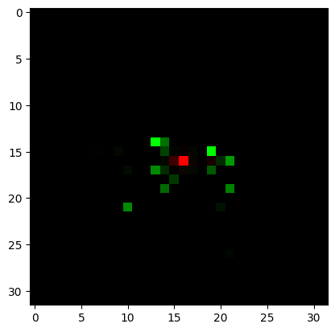
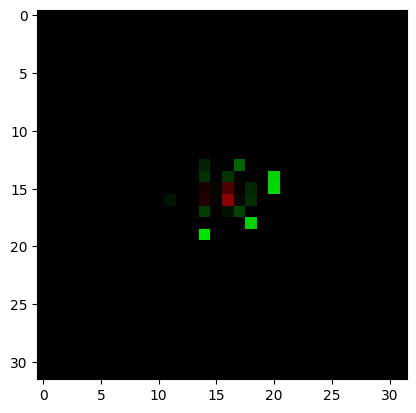

# Graph Neural Networks for Particle Momentum Estimation in the CMS Trigger System

## Dataset structure

The dataset consists of 2 hdf5 files, 1 for each label (electron and photon)

The images are `32x32` matrices with two channels: hit energy and time for two types of
particles, electrons and photons, hitting the detector.

A sample from the `electron` class looks like:

A sample from the `photon` class looks like:

## Resnet-15

For resnet-15, the images were resized to `128x128` and were converted from 2-channel to 3-channel by concatenating zeros.

Due to large number of parameters in resnet-15, training loss was very high and was declining slowly.

See [this notebook](ResNet-15.ipynb) for model architecture and training results

Despite a training duration of approximately 12 hours, the model failed to achieve substantial accuracy, peaking at a maximum of 0.5.

The inability to extend the training duration further was attributed to constraints in computational resources.

## Resnet (small)

ResNet-15 comprises a substantial number of parameters, necessitating considerable time for optimization.
So, an alternative model featuring only a single ResNet block was explored.

See [this notebook](resnet-small.ipynb) for model architecture and training results

This model achieved a peak validation accuracy of `60.55%` without overfitting.